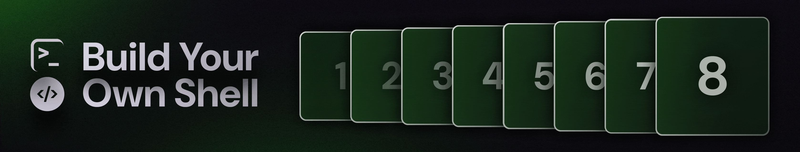
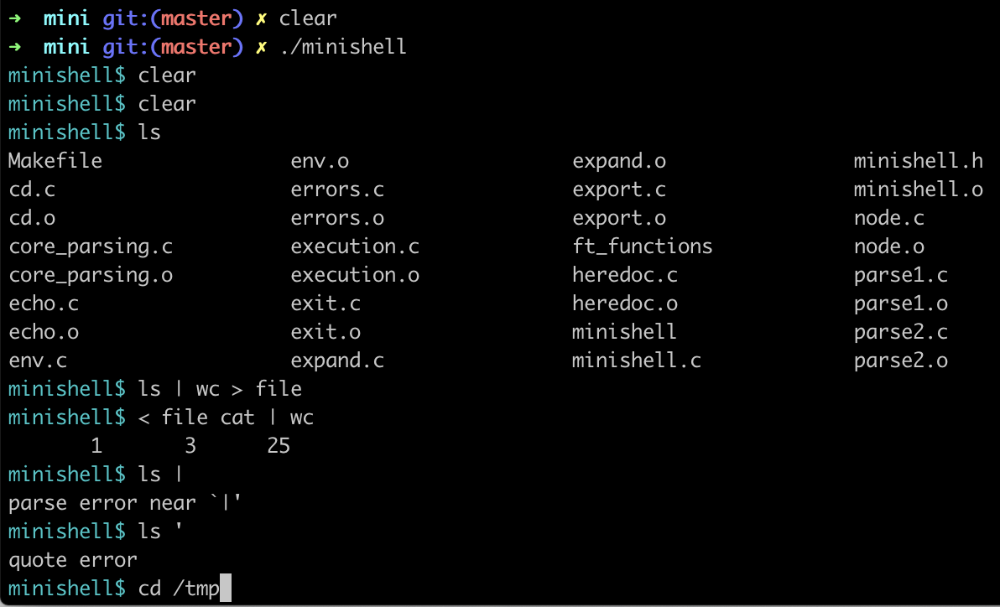

# Build your own Shell



## Project Overview

Minishell is a project which aims to create a shell. In this challenge, i builded my own POSIX compliant shell that's capable of interpreting shell commands, running external programs and builtin commands like cd, pwd, echo and more. Along the way, i learned about shell command parsing, REPLs, builtin commands, and more...


## Features

- Prompt display
- Command execution with their parameters
- Builtins `echo`, `cd`, `export`, `unset`, `env`, `exit`
- Redirections `>` `>>` `<` `<<`
- Pipes `|`
- Environment variables `$VAR_NAME`
- Signal management `ctrl-C`, `ctrl-\`, `ctrl-D`
- heredoc

## Building and Running

To compile the project, run:

```bash
make

To run the project, use:

./minshell
